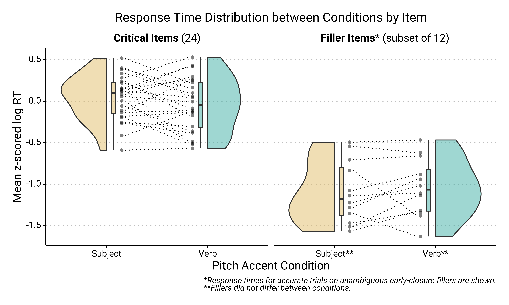

# geom_paired_raincloud
{ggplot2} geom for visualizing differences between a pair of conditions (e.g., pre-/post-test) when the same subjects or items are involved in both conditions

To use `geom_paired_raincloud()`, source this repo with `devtools::source_url("https://raw.githubusercontent.com/yjunechoe/geom_paired_raincloud/master/geom_paired_raincloud.R")`

Details and motivation in this blogpost: https://yjunechoe.netlify.app/post/geom-paired-raincloud/
